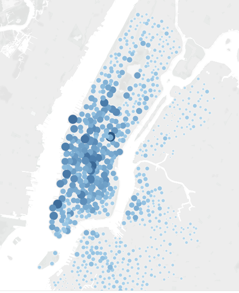
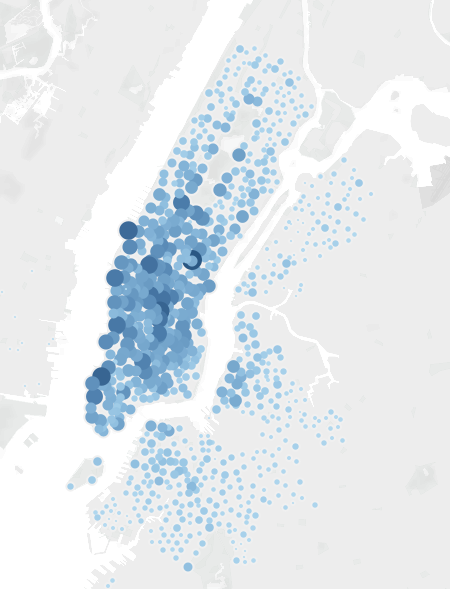
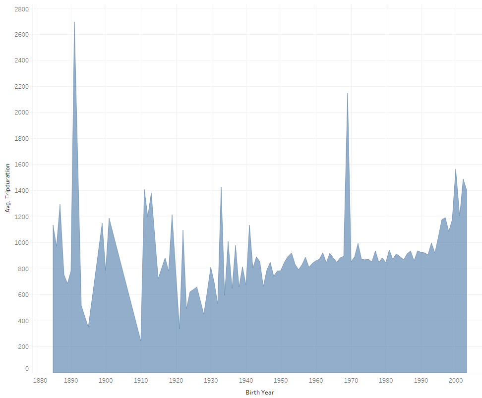
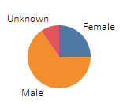
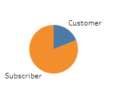
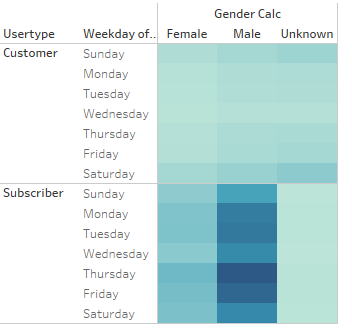
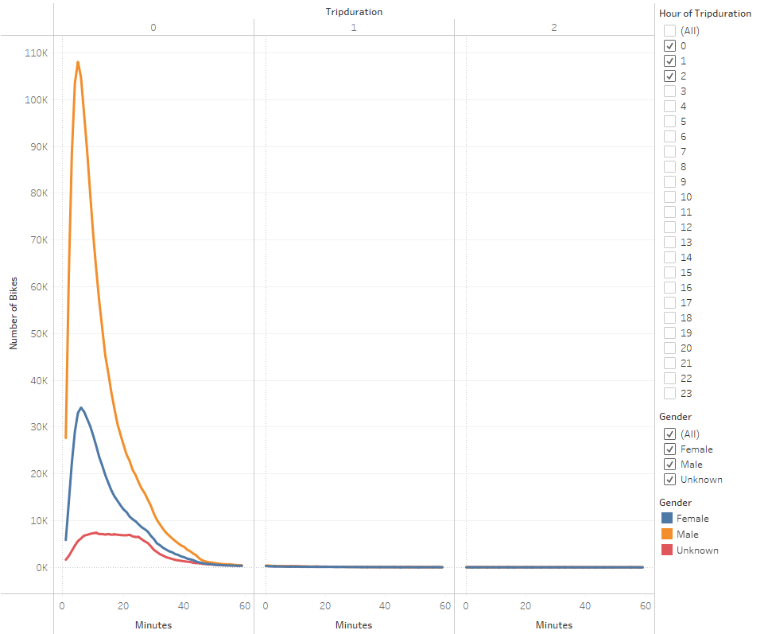
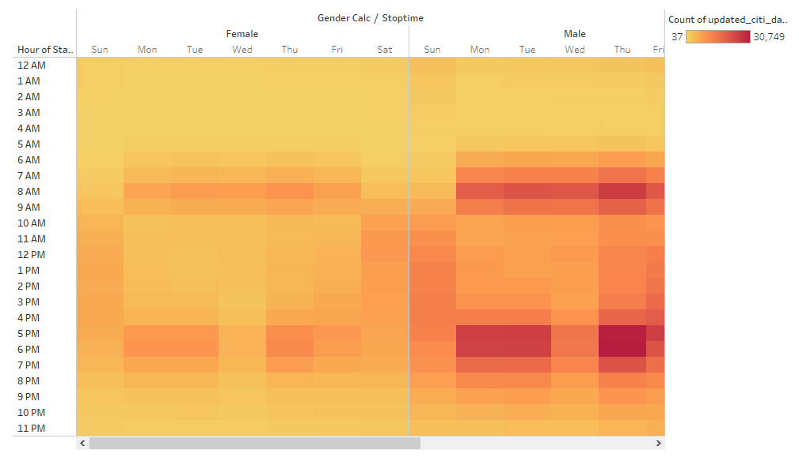

# Bike Sharing
## Overview
This Tableau analysis looks as CitiBike data taken from the month of August in New York City and will be used to support the proposal of bringing bike sharing to Des Moines.  

[Dashboard Link](https://public.tableau.com/app/profile/amanda.mccabe/viz/citiBike_16480854796860/TopStartingLocations?publish=yes)
## Results
There is a correlation between popular starting and ending locations.

Younger individuals tend to take longer rides.

Male subscribers comprise the majority of users.

Most rides are under 1 hour in duration.

Weekday mornings and evenings are the most popular riding times. 

## Summary
Males tend to comprise the largest user group.  

Usage in the morning and evening indicates that users maybe using this for transportation to work so populating the bikes is business areas in the evenings will help to ensure there are ample bikes available for commutes home. 

August tends to be a warmer month.  Vizualizing data from other months, especially the colder months, would help to get a better picture of what year round usage may be. Additionally, looking at other cities that use these bikes and vizualizing their data would also be beneficial to see if the data supports the same findings or if there is significant variation between cities.  